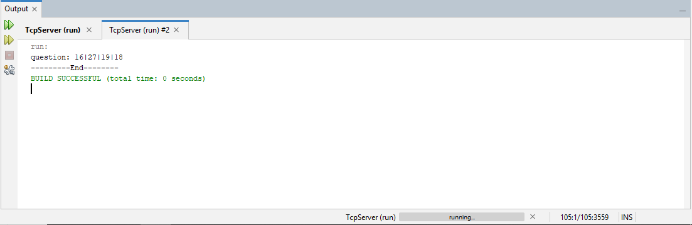
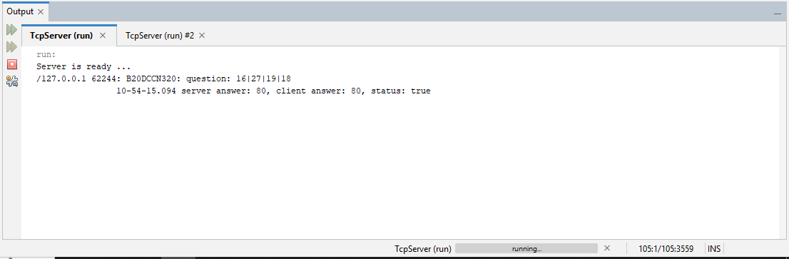
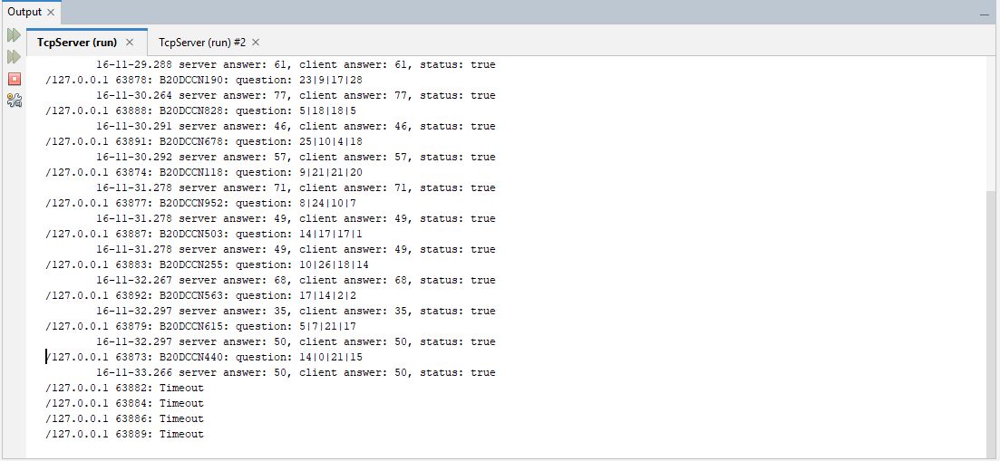

# Đề bài
- Một chương trình server hỗ trợ kết nối qua giao thức TCP tại cổng 806 (hỗ trợ thời gian giao tiếp tối đa cho mỗi yêu cầu là 5s). 
- Yêu cầu xây dựng chương trình client thực hiện kết nối tới server trên sử dụng luồng byte dữ liệu (InputStream/OutputStream) để trao đổi thông tin theo thứ tự: 
- a.	Gửi mã sinh viên và mã câu hỏi theo định dạng "studentCode;qCode". Ví dụ: "B16DCCN999;700"
- b.	Nhận dữ liệu từ server là một chuỗi gồm hai giá trị nguyên được phân tách với nhau bằng  "|"
Ex: 2|5|9|11
- c.	Thực hiện tìm giá trị tổng của các số nguyên trong chuỗi và gửi lên server
Ex: 27
- d.	Đóng kết nối và kết thúc
## Bài làm
### Tiếp cận thông thường
#### 1. TCPServer
```Java
package tcpserver;

import java.io.DataInputStream;
import java.io.DataOutputStream;
import java.io.IOException;
import java.net.ServerSocket;
import java.net.Socket;
import java.net.SocketTimeoutException;
import java.text.SimpleDateFormat;
import java.util.Date;
import java.util.Random;

/**
 *
 * @author QuangHuy
 */
public class TCPServer {

    /**
     * @param args the command line arguments
     */
    private static int[] genRandomArr(int sz, int seed) {
        int[] a = new int[sz];
        Random rand = new Random(seed);

        for (int i = 0; i < sz; i++) {
            a[i] = rand.nextInt(30);
        }
        return a;
    }

    private static String genQuestion(int[] arr) {
        String question = "";
        for (int i = 0; i < arr.length - 1; i++) {
            question += arr[i] + "|";
        }
        question += arr[3];
        return question;
    }

    private static int getAnswer(int[] arr) {
        int serverAns = 0;
        for (int i = 0; i < arr.length; i++) {
            serverAns += arr[i];
        }
        return serverAns;
    }
     private static String currentTime() {
        SimpleDateFormat format = new SimpleDateFormat("HH-mm-ss.SSS");
        return format.format(new Date());
    }
    public static void main(String[] args) throws IOException {
        ServerSocket server = new ServerSocket(806);
        System.out.println("Server is ready ...");
        int TIME_OUT = 5000;
        
        while (true) {
            Socket conn = null;
            try {
                conn = server.accept();
                // set time out = 5000ms
                conn.setSoTimeout(TIME_OUT);
                DataInputStream dis = new DataInputStream(conn.getInputStream());
                DataOutputStream dos = new DataOutputStream(conn.getOutputStream());
                
                // get requestcode = studentcode + questioncode
                String[] requestCode = dis.readUTF().split(";");
                String studentCode = requestCode[0];
                int qCode = 0;
                try {
                    qCode = Integer.parseInt(requestCode[1]);
                } catch (NumberFormatException ex) {
                    System.out.println(ex.getCause());
                }
                // gen 4 number
                int[] randArr = genRandomArr(4, qCode);
                
                // gen question from 4 number
                String question = genQuestion(randArr);
                dos.writeUTF(question);
                // get client answer
                int clientAns = dis.readInt();
                int serverAns = getAnswer(randArr);
                // Log
                System.out.format("%s %d: %s: question: %s \n\t\t%s server answer: %d, client answer: %d, status: %s\n", 
                        conn.getInetAddress(), conn.getPort(), studentCode, question, currentTime(), clientAns, serverAns, clientAns == serverAns);
                
                dis.close();
                dos.close();
                conn.close();
            } catch (SocketTimeoutException ex) {
                if(conn != null)
                    System.out.println(conn.getInetAddress() + " " + conn.getPort() + ": Timeout");
            } catch(IOException ex) {
                System.out.println(ex.getCause());
            }
        }
    }

}
```

#### 2. TCPClient
```Java
package tcpserver;

import java.io.DataInputStream;
import java.io.DataOutputStream;
import java.io.IOException;
import java.net.Socket;
import java.util.concurrent.TimeUnit;

/**
 *
 * @author QuangHuy
 */
public class TCPClient {
    private static int calcSum(String question) {
        String[] arr = question.split("\\|");
        int sum = 0;
        for(int i = 0; i < arr.length; i++) {
            sum += Integer.parseInt(arr[i]);
        }
        return sum;
    }
    public static void main(String[] args) throws IOException, InterruptedException {
        try(Socket socket = new Socket("localhost", 806); 
                DataInputStream dis = new DataInputStream(socket.getInputStream());
                DataOutputStream dos = new DataOutputStream(socket.getOutputStream());) {
            
            String studentCode = "B20DCCN320";
            String questionCode = "q700";
            String requestCode = studentCode + ";" + questionCode;
            // send request with studentcode and question code to server
            dos.writeUTF(requestCode);
            // get question from server
            String question = dis.readUTF();
            int sum = calcSum(question);
            System.out.println("question: " + question);
//            TimeUnit.SECONDS.sleep(5);
            // send back to server
            dos.writeInt(sum);
        }
        System.out.println("---------End--------");
    }
}

```
Output:
- TCPClient:


- TCPServer



### Tiếp cận multithread
#### 1. TCPClient
```Java
package tcpserver_thread;

import java.io.DataInputStream;
import java.io.DataOutputStream;
import java.io.IOException;
import java.net.Socket;
import java.util.concurrent.TimeUnit;

/**
 *
 * @author QuangHuy
 */
public class TCPClient implements Runnable{
    private final String studentCode;
    private final int questionCode;
    private final String serverAddress;
    private final int serverPort;
    private Socket client;
    
    private int calcSum(String question) {
        String[] arr = question.split("\\|");
        int sum = 0;
        for (String x : arr) {
            sum += Integer.parseInt(x);
        }
        return sum;
    }
    public TCPClient(String studentCode, int questionCode, String serverAddress, int serverPort) {
        this.studentCode = studentCode;
        this.questionCode = questionCode;
        this.serverAddress = serverAddress;
        this.serverPort = serverPort;
    }
    
    @Override
    public void run() {
        try {
            this.client = new Socket(this.serverAddress, this.serverPort);
            DataInputStream dis = new DataInputStream(this.client.getInputStream());
            DataOutputStream dos = new DataOutputStream(this.client.getOutputStream());
            
            String requestCode = studentCode + ";" + questionCode;
            // send request with studentcode and question code to server
            dos.writeUTF(requestCode);
            // get question from server
            String question = dis.readUTF();
            int sum = calcSum(question);
            System.out.println("question: " + question);
//            TimeUnit.SECONDS.sleep((int) (Math.random() * 6));
            // send back to server
            dos.writeInt(sum);
            dis.close();
            dos.close();
            System.out.println("---------End--------");
        } catch(IOException ex) {
            // TODO: handle
        }
        finally {
            shutdown();
        }
    }
    public void shutdown() {
        try {
            if (!this.client.isClosed()) {
                this.client.close();
            }
        } catch (IOException ex) {
            // TODO: handle
        }
    }
    public static void main(String[] args) throws IOException, InterruptedException {
        String studentCode = "B20DCCN320";
        int questionCode = 40;
        String serverAddress = "localhost";
        int serverPort = 806;
        TCPClient client = new TCPClient(studentCode, questionCode, serverAddress, serverPort);
        client.run();
    }

}
```
#### 2. ClientHandler (handle cho kết nối từ client sang server)
```Java
package tcpserver_thread;

import java.io.DataInputStream;
import java.io.DataOutputStream;
import java.io.IOException;
import java.net.Socket;
import java.net.SocketTimeoutException;
import java.text.SimpleDateFormat;
import java.util.Date;
import java.util.Random;
import java.util.regex.Matcher;
import java.util.regex.Pattern;

/**
 *
 * @author QuangHuy
 */
public class ClientHandler implements Runnable {
    private final Socket socket;
    private static final int TIMEOUT = 5000;

    public ClientHandler(Socket socket){
        this.socket = socket;
    }

    public int[] genRandomArr(int sz, int seed) {
        int[] a = new int[sz];
        Random rand = new Random(seed);

        for (int i = 0; i < sz; i++) {
            a[i] = rand.nextInt(30);
        }
        return a;
    }

    public String genQuestion(int[] arr) {
        String question = "";
        for (int i = 0; i < arr.length - 1; i++) {
            question += arr[i] + "|";
        }
        question += arr[3];
        return question;
    }

    public int getAnswer(int[] arr) {
        int serverAns = 0;
        for (int i = 0; i < arr.length; i++) {
            serverAns += arr[i];
        }
        return serverAns;
    }

    private String currentTime() {
        SimpleDateFormat format = new SimpleDateFormat("HH-mm-ss.SSS");
        return format.format(new Date());
    }

    public boolean isValidateRequestCode(String requestCode) {
        String regexRequest = "^[Bb]\\d{2}[A-Za-z]{4}\\d{3};\\d+$";
        Pattern pattern = Pattern.compile(regexRequest);
        Matcher matcher = pattern.matcher(requestCode);
        return matcher.matches();
    }

    @Override
    public void run() {
        try {
            socket.setSoTimeout(TIMEOUT);
            DataInputStream dis = new DataInputStream(socket.getInputStream());
            DataOutputStream dos = new DataOutputStream(socket.getOutputStream());

            // get requestcode = studentcode + questioncode
            String requestCode = dis.readUTF();
            // check requestCode
            if (!isValidateRequestCode(requestCode)) {
                dos.writeUTF("INVALID REQUEST");
            } else {
                String[] code = requestCode.split(";");

                String studentCode = code[0];
                int qCode  = Integer.parseInt(code[1]);
                
                // gen 4 number
                int[] randArr = genRandomArr(4, qCode);
                // gen question from 4 number
                String question = genQuestion(randArr);
                dos.writeUTF(question);
                // get client answer
                int clientAns = dis.readInt();
                int serverAns = getAnswer(randArr);
                // Log
                System.out.format("%s %d: %s: question: %s \n\t%s server answer: %d, client answer: %d, status: %s\n",
                        this.socket.getInetAddress(), this.socket.getPort(), studentCode, question, currentTime(), clientAns, serverAns, clientAns == serverAns);
            }

//             send result to client
//            dos.writeUTF("Result: " +  (clientAns == serverAns));
        } catch (SocketTimeoutException ex) {
            if (socket != null) {
                System.out.println(this.socket.getInetAddress() + " " + this.socket.getPort() + ": Timeout");
            }
        } catch (IOException ex) {
            // TODO: handle
        } finally {
            shutdown();
        }
    }

    public void shutdown() {
        try {
            if (!this.socket.isClosed()) {
                this.socket.close();
            }
        } catch (IOException ex) {
            // TODO: handle
        }
    }
}

```
#### 3. TCPServer
```Java
package tcpserver_thread;

import java.io.IOException;
import java.net.ServerSocket;
import java.net.Socket;
import java.util.concurrent.ExecutorService;
import java.util.concurrent.Executors;


/**
 *
 * @author QuangHuy
 */
public class TCPServer implements Runnable {
    private ServerSocket server;
    private ExecutorService pool;

    public TCPServer() {
    }
    
    /**
     * @param args the command line arguments
     */
    @Override
    public void run() {
        try {
            this.server = new ServerSocket(806);
//            this.pool = Executors.newCachedThreadPool();
            this.pool = Executors.newFixedThreadPool(20);
            System.out.println("Server is ready ...");
            while (true) {
                Socket conn = null;
                try {
                    conn = this.server.accept();
                    ClientHandler clientHandler = new ClientHandler(conn);
                    pool.execute(clientHandler);
//                    Thread t = new Thread(clientHandler);
//                    t.start();
                } catch (IOException ex) {
                    System.out.println(ex.getCause());
                }
            }
        } catch (IOException ex) {
            // TODO: handle
        }
    }
    public void shutdown() {
        if(this.server != null && this.server.isClosed()) {
            try {
                this.server.close();
            } catch (IOException ex) {
                // TODO: handle
            }
        }
    }

    public static void main(String[] args) throws IOException {
        TCPServer server = new TCPServer();
        server.run();
    }

}
```
#### Output
```
Server is ready ...
/127.0.0.1 49741: B20DCCN688: question: 23|26|12|27 
	11-56-17.421 server answer: 88, client answer: 88, status: true
/127.0.0.1 49745: B20DCCN329: question: 21|12|18|10 
	11-56-17.422 server answer: 61, client answer: 61, status: true
/127.0.0.1 49735: B20DCCN82: question: 11|3|6|13 
	11-56-17.429 server answer: 33, client answer: 33, status: true
/127.0.0.1 49738: B20DCCN573: question: 26|19|13|23 
	11-56-17.431 server answer: 81, client answer: 81, status: true
...
/127.0.0.1 49772: B20DCCN490: question: 24|27|20|15 
	11-56-17.509 server answer: 86, client answer: 86, status: true
```

#### Một số vấn đề vẫn còn gặp phải
